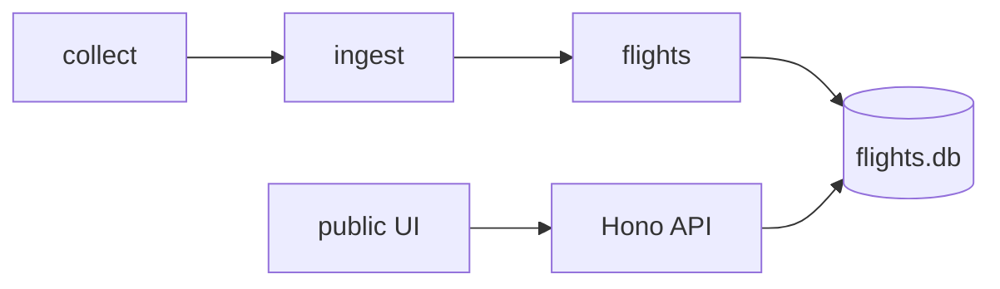

# Perth Airport arrivals and departures

Live flight board for Perth Airport (PER). Collects departures and arrivals via Playwright, stores them in **SQLite** (`data/flights.db`), and serves the board through a small **Hono API** and static UI at `/`.

## Setup

**Node.js 22 LTS** is required (`better-sqlite3` has prebuilt binaries for 22 on Windows). Check with `node -v` — use `v22.x`, not `v24.x`.

```bash
npm install
npx playwright install chromium
npm run migrate
```

## Commands

| Command | Description |
|---------|-------------|
| `npm run collect` | Fetch boards from Perth Airport and merge into SQLite |
| `npm run migrate` | Apply SQLite migrations |
| `npm run dev` | API + flight board at http://localhost:3000/ |
| `npm run start` | Same as `dev` (production / Docker API) |
| `npm run db:generate` | Generate Drizzle migrations from schema |

## Docker (recommended for production)

**Local + mobile (ngrok):** see [docs/running-locally-docker-ngrok.md](docs/running-locally-docker-ngrok.md).

**Prerequisites:** Docker Desktop or Docker Engine + Compose v2.

```bash
docker compose build
docker compose up -d api
```

Open **http://localhost:3000/**

**First data load** (one-off collect into the shared volume):

```bash
docker compose --profile collect run --rm collector
```

**Continuous collection** (default every 15 minutes):

```bash
docker compose --profile scheduler up -d
```

| Command | Description |
|---------|-------------|
| `docker compose build` | Build `perth-airport-arrivals-and-departures:latest` |
| `docker compose up -d api` | Flight board API + UI |
| `docker compose --profile collect run --rm collector` | Single collect run |
| `docker compose --profile scheduler up -d` | API + periodic collector |
| `docker compose logs -f api` | API logs |
| `docker compose down` | Stop containers (volume keeps DB) |

Environment variables (compose or `.env`): `PORT`, `DATABASE_PATH`, `SCRAPE_INTERVAL_SECONDS`, `SCRAPE_NEXT_DAY_HOURS_BEFORE_MIDNIGHT`.

## Architecture



- **Collect** (`npm run collect`): Playwright → Zod validate → content-hash compare → upsert changed rows only.
- **Database**: SQLite with WAL; one writer (collect), many readers (API).
- **API**: `GET /api/meta`, `GET /api/flights` (Zod-validated query params).
- **UI** ([`public/`](public/)): Polls `/api/meta` every 60s; refetches when `scrapeRevision` changes.

## API

| Endpoint | Description |
|----------|-------------|
| `GET /api/meta?direction=arrivals\|departures` | Store metadata |
| `GET /api/flights?...` | Filtered flight list + meta |

Query parameters for `/api/flights`: `direction`, `domInt`, `terminalGroup`, `hours`, `boardDate`, `hideCompleted`.

## Environment variables

| Variable | Default | Purpose |
|----------|---------|---------|
| `DATABASE_PATH` | `data/flights.db` | SQLite file path |
| `PORT` | `3000` | API server port |
| `SCRAPE_INTERVAL_SECONDS` | `900` | Scheduler interval (Docker) |
| `SCRAPE_NEXT_DAY_HOURS_BEFORE_MIDNIGHT` | `3` | When to prefetch tomorrow's board |

## Quick start

```bash
npm install
npm run migrate
npm run collect
npm run dev
```

## Troubleshooting

- **Docker: empty board** — Run `docker compose --profile collect run --rm collector` once.
- **No data / 404 from API** — Run `npm run collect` after `npm run migrate`.
- **Node 24 on Windows** — Use Docker or install Node 22 LTS.
- **Port in use** — Set `PORT=3001 npm run dev`.
- **Playwright browser missing** — `npx playwright install chromium`
