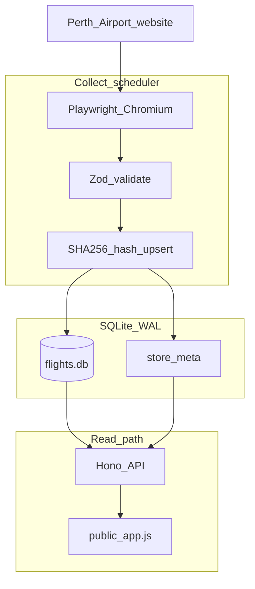

# Architecture

High-level design of the Perth Airport flight board: collect → SQLite → read-only API → static UI.

## Stack

| Layer | Technology | Role |
|-------|------------|------|
| Runtime | Node.js 22 LTS | `engines` in package.json; required for `better-sqlite3` prebuilds on Windows |
| Language | TypeScript (ESM) | Application code under `src/` and `scripts/` |
| Collect | Playwright (Chromium) | Load official flights page; POST `GetFlightResults` inside browser context |
| Validation | Zod | Airport JSON and API query/response schemas |
| Database | SQLite + `better-sqlite3` | Single file (`flights.db`); WAL mode |
| ORM / migrations | Drizzle ORM + drizzle-kit | Schema in `src/db/schema.ts`; SQL in `drizzle/` |
| API | Hono + `@hono/node-server` | Read-only HTTP; serves `public/` static files |
| UI | Vanilla HTML/CSS/JS | `public/index.html`, `public/app.js`, `public/styles.css` |
| Containers | Docker Compose | `api`, `collector`, `scheduler` sharing a volume |

No frontend framework; no separate build step for the UI.

## Data flow

### Collect path

1. **`npm run collect`** or Docker `collector` / `scheduler` runs [`scripts/collect.ts`](../scripts/collect.ts).
2. [`src/ingest/perth-airport.ts`](../src/ingest/perth-airport.ts) opens the [official flights page](https://www.perthairport.com.au/flights/departures-and-arrivals), reads the CSRF token, and POSTs from inside the page so session cookies apply.
3. Responses are validated with [`src/schemas/airport-api.ts`](../src/schemas/airport-api.ts).
4. [`src/flights/flight-store.ts`](../src/flights/flight-store.ts) merges into SQLite: hash each row, skip unchanged, upsert changed, prune old board dates.

### Read path

1. [`src/api/server.ts`](../src/api/server.ts) serves static UI and JSON under `/api/*`.
2. [`src/api/queries.ts`](../src/api/queries.ts) reads flights with SQL time cutoffs (AWST) plus client-side filters (terminal, dom/int, hide completed).
3. [`public/app.js`](../public/app.js) polls `/api/meta` every 60s and refetches `/api/flights` when `scrapeRevision` changes.

## Writer / reader model

| Role | Processes | SQLite access |
|------|-----------|---------------|
| Writer | `collect`, Docker `collector`, Docker `scheduler` | INSERT/UPDATE/DELETE during merge |
| Reader | `dev` / `start`, Docker `api` | SELECT only |

**Only one collect should run at a time** against the same database file. Do not overlap `collector` and `scheduler` scrapes.

## Board date retention

On each collect, retained board dates are typically:

- **Yesterday** and **today** (AWST calendar dates on the board)
- **Tomorrow** during the prefetch window (default 3 hours before AWST midnight, `SCRAPE_NEXT_DAY_HOURS_BEFORE_MIDNIGHT`)

Older board dates are pruned. See [`scripts/collect.ts`](../scripts/collect.ts) and [`src/config/config.ts`](../src/config/config.ts).

## Environment variables

| Variable | Default | Used by |
|----------|---------|---------|
| `DATABASE_PATH` | `data/flights.db` | Collect + API |
| `PORT` | `3000` | API |
| `SCRAPE_INTERVAL_SECONDS` | `300` | Docker scheduler loop |
| `SCRAPE_NEXT_DAY_HOURS_BEFORE_MIDNIGHT` | `3` | Collect prefetch window |
| `CORS_ORIGIN` | `*` | API CORS (set to ngrok URL when tunneling) |

See [docker.md](docker.md) for Compose-specific paths (`/app/data/flights.db` in containers).

## API surface (summary)

| Endpoint | Purpose |
|----------|---------|
| `GET /api/health` | Uptime; latest scrape timestamp |
| `GET /api/meta?direction=` | Board metadata for arrivals or departures |
| `GET /api/flights?...` | Filtered flight list + meta |

Full reference: [api.md](api.md).

## Related docs

- [project-structure.md](project-structure.md) — file layout
- [scraping-and-failures.md](scraping-and-failures.md) — collect failure modes
- [docker.md](docker.md) — deployment topology
