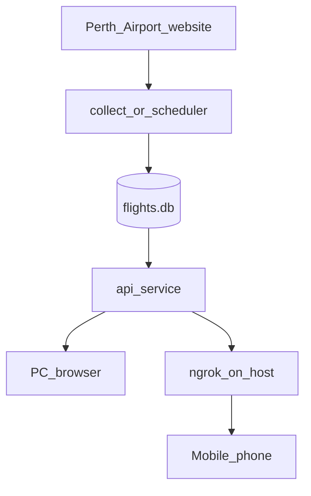

# Running locally with Docker and ngrok (mobile access)

This guide explains how the flight board, data collection, and ngrok fit together when you run the stack on your PC and open it from your phone.

## What each piece does

| Piece | What it is | What it does |
|--------|------------|----------------|
| **Web app (API)** | Docker service `api` | Serves the flight board in the browser and answers `/api/flights`. It **only reads** the database. It does **not** fetch flights from Perth Airport. |
| **Collect** | One-shot job (`collector`) | Opens Perth Airport in a headless browser, scrapes the boards, **writes** into SQLite (`flights.db`). Runs once and **stops**. |
| **Scheduler** | Docker service `scheduler` | Same scrape as collect, but **every 15 minutes** by default (`SCRAPE_INTERVAL_SECONDS=900`), forever. Keeps the database fresh. |
| **ngrok** | Program on your PC (not in Docker) | Gives you a public `https://….ngrok….` link that forwards to `localhost:3000` so your phone can open the site from anywhere. |

All Docker services share the `flight-data` volume (see [docker-compose.yml](../docker-compose.yml)).

## Data flow



1. **Scheduler** (or a one-off **collect**) scrapes Perth Airport and writes to SQLite.
2. **API** reads SQLite and serves the UI + JSON API on port **3000** inside Docker (published to the host as `${PORT:-3000}`).
3. **ngrok** on the host tunnels that port to the internet for your phone.

## How Compose services relate

| Service | Profile | Keeps running? |
|---------|---------|----------------|
| `api` | (none — always eligible) | Yes |
| `collector` | `collect` | No — exits after one scrape |
| `scheduler` | `scheduler` | Yes — scrape loop |

- `docker compose up -d` or `docker compose up -d api` starts **only** `api`. The board will not update until you run a collect or start the scheduler.
- `docker compose --profile scheduler up -d` starts **`api` + `scheduler`** (recommended for normal use).

## Commands

### First time (build + data + app + updates)

```bash
docker compose build
docker compose --profile collect run --rm collector
docker compose --profile scheduler up -d
```

Then in a **second terminal** on the host:

```bash
ngrok http 3000
```

Use a different host port if you set `PORT` in `.env` (e.g. `ngrok http 3001`).

### Every day (app + auto-updates)

```bash
docker compose --profile scheduler up -d
ngrok http 3000
```

### After code changes (git pull or local edits)

The board and API run from the Docker image. Restarting containers alone does **not** pick up new `public/` or `src/` files — rebuild and recreate:

**API + scheduler (normal setup):**

```bash
docker compose build
docker compose --profile scheduler up -d --force-recreate
```

**API only** (no scheduler profile):

```bash
docker compose build api
docker compose up -d --force-recreate api
```

Then refresh the browser (hard refresh on the phone if the UI looks cached).

### Faster first load (optional)

If you skip the one-off `collect` step, the board may be empty until the scheduler finishes its **first** scrape. Watch progress:

```bash
docker compose logs -f scheduler
```

When you see `Collect OK`, refresh the browser.

## Accessing the board

| Where you open | URL |
|----------------|-----|
| On your PC | http://localhost:3000/ |
| On your phone | The **https** URL from ngrok (bookmark it) |

The UI uses relative paths (`/api/meta`, `/api/flights`), so the same ngrok origin works for API calls without extra configuration.

## Conflicts to avoid

- **Do not** run `collector` and `scheduler` scraping **at the same time**. Both write to the same SQLite file; the project assumes **one writer** for collects. Overlap can cause duplicate scrapes or database lock errors.
- **Do** run **`api` + `scheduler`** together — that is the intended setup.
- You do **not** need manual `collect` on every startup if `scheduler` is already running.

## ngrok on the host (not in Docker)

This project uses ngrok on your machine, not as a Compose service:

- Simpler setup (no `NGROK_AUTHTOKEN` in compose).
- Tunnel target: the host port mapped to `api` (default **3000**).
- **Requirements:** Docker stack running, ngrok running, PC awake. If any of these stop, the phone link stops working.
- Free ngrok URLs often **change** when you restart the tunnel; update your phone bookmark or use a reserved domain on a paid plan.

For **24/7** access without leaving your PC on, deploy the same Docker stack to a VPS or cloud host instead of relying on ngrok at home.

## Troubleshooting

| Problem | What to do |
|---------|------------|
| Empty board | Run `docker compose --profile collect run --rm collector` once, or wait for the scheduler’s first collect and check `docker compose logs -f scheduler`. |
| 404 from API | No data for that direction yet — run collect or wait for scheduler. |
| Phone link dead | Confirm `docker compose ps` shows `api` up, ngrok is still running, and you are using the current https URL. |
| Stale flights | Confirm `scheduler` is running: `docker compose --profile scheduler up -d`. |
| Old UI or API after `git pull` | Rebuild and recreate — see [After code changes](#after-code-changes-git-pull-or-local-edits). |
| Port in use | Set `PORT=3001` in `.env`, recreate containers, then `ngrok http 3001`. |

## Related docs

- [README.md](../README.md) — setup, API, environment variables
- [docker-compose.yml](../docker-compose.yml) — service definitions and profiles
